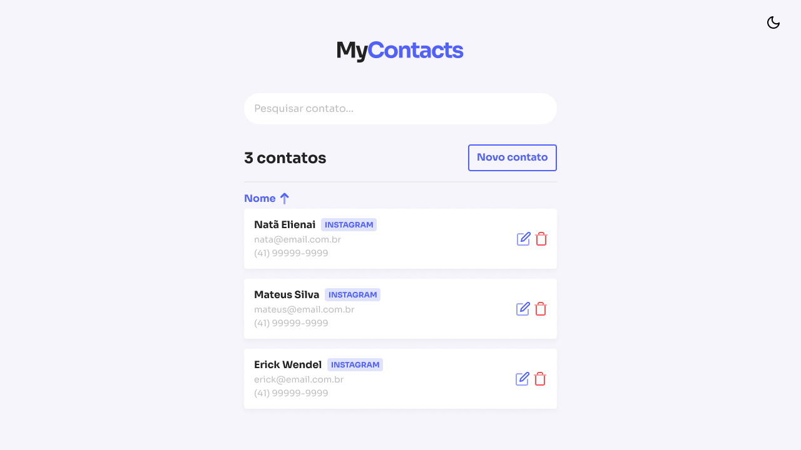

# MyContacts

<p align="center">
  
</p>

MyContacts é um Web App que permite aos usuários salvarem e categorizarem seus contatos.

O objetivo do projeto foi utilizar o mínimo de bibliotecas possíveis durante o seu desenvolvimento, fazendo disso uma forma de aprender como as tecnologias funcionam "por baixo dos panos".

Este projeto foi desenvolvido durante o curso [JStack](https://jstack.com.br/).

[Projeto no Figma](https://www.figma.com/file/sgnH98HkOtbB09uA1SOVpW/MyContacts?type=design&node-id=0%3A1&mode=design&t=8Bj9pEEbR5pnDwXE-1)

## Tecnologias

- Linguagem: JavaScript
- Gerenciador de pacotes: Yarn
- Bibliotecas: React, React Router DOM e Styled Components
- Ferramentas: ESLint, EditorConfig, Git e Figma

## Dependências

Antes de tudo, é necessário estar com a [API](https://github.com/nataelienai/mycontacts-api) do projeto já em execução para que esta aplicação funcione.

Para executar esta aplicação em seu computador, você precisará de [Git](https://git-scm.com/downloads) e [Node.js](https://nodejs.org/) instalados.

## Como executar

1. Abra um terminal e clone o repositório:
```sh
git clone https://github.com/nataelienai/mycontacts.git
```

2. Entre na pasta do repositório clonado:
```sh
cd mycontacts
```

3. Instale o Yarn (caso não o tenha):
```sh
npm install -g yarn
```

4. Instale as dependências do projeto:
```sh
yarn
```

5. Inicialize a aplicação:
```sh
yarn start
```
